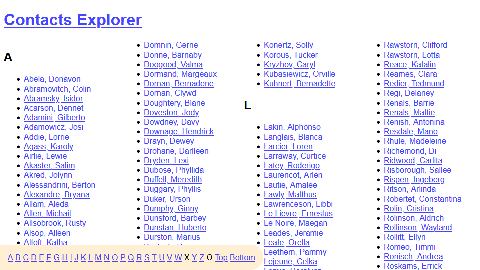

# Contacts Explorer

**A revolutionary new way to view your contact records!**

* Supports at least 1000 contacts before running out of memory.
* Utilising multi-column technology, fits up to 400 links on a 1080p monitor.
* Features innovative "random" button for deciding who to sack.
* Unrivalled graphic design.
* Pays homage to but doesn't actually support Internet Explorer.

## Screenshots

Sized to 960&times;540 for viewing convenience.

